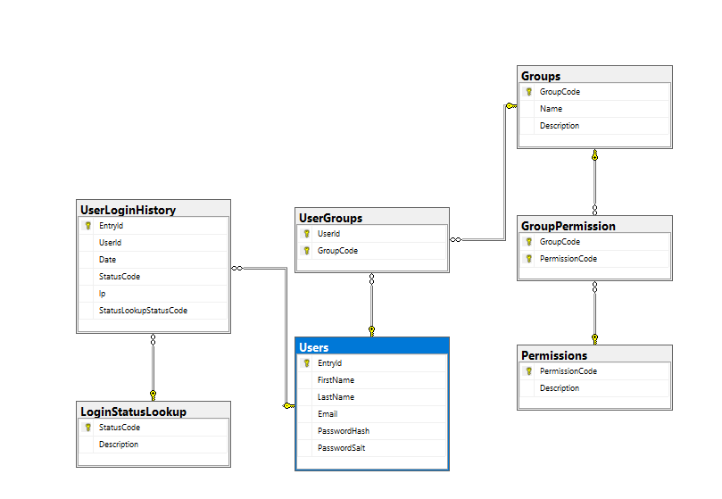

# User Management System

## Welcome!

1. [Getting Started](#1-getting-started)
   1. [Requirements](#11-requirements)
   2. [Setting up database](#12-setting-up-database)
2. [Database Design](#2-database-design)
3. [Backend Information](#3-backend-information)
    1. [Layout](#31-layout)
    2. [Error Handling](#32-error-handling)
---

## 1. Getting Started

Getting started should be as easy as providing a database connection string. The system is set up using the code-first approach with Entity Framework.

### 1.1 Requirements
- **.NET 8.0**
- **MSSQL Server**

### 1.2 Setting up database
The code uses the `Seed` class, which contains a function `SeedDataAndMigrate(ManagementContext context)`. This function applies the database migrations to the SQL Server, which will in turn create the database and tables. Some data has also been seeded to make setup easier. 

The only thing needed is to update the server connection string in the development `appsettings`.

The frontend and backend are 2 separate projects, so you'll need to open them each

> **NOTE:** I have attached the database creation script as well.

> **NOTE:** The login details to the admin user is email:meow@meow.com, password:meow.
> **NOTE:** Normally you would send an email to the user to reset their password, this was not included where they would set/reset their password
--- 

### 2. Database Design

Here I'll briefly discuss some of the table designs.

> **NOTE:** There are places where I used NVARCHARs as primary codes. These tables are often lookup tables. It is better to have these as self-generated codes instead of identity fields. The reason being is, it makes it easier to deal with in code if, for example, users with Permissions code: PRM00001 can access x and y. This also makes deployments much easier.

```sql
CREATE TABLE Users (
    EntryId INT IDENTITY NOT NULL,
    FirstName NVARCHAR(100) NOT NULL,
    LastName NVARCHAR(100) NOT NULL,
    Email NVARCHAR(255) NOT NULL,
    PasswordHash NVARCHAR(255) NOT NULL,
    PasswordSalt NVARCHAR(255) NOT NULL,
    CONSTRAINT pk_User_Entry_Id PRIMARY KEY (EntryId),
    CONSTRAINT idx_Users_Email UNIQUE (Email)
); 
```
Skipping the obvious stuff (Firstname, Lastname, Email).

Hash and salt fields were created for password security and to not store passwords in plain text.
An index was created on the email field since it is a field that is commonly queried. The reason it is not the primary key is because users can and will change their emails now and then.

```sql
CREATE TABLE UserLoginHistory (
    EntryId INT IDENTITY NOT NULL,
    UserId INT,
    Ip NVARCHAR(MAX) NOT NULL,
    Date DATETIME2 NOT NULL,
    StatusCode VARCHAR(3) NOT NULL,
    CONSTRAINT PK_UserLoginHistory PRIMARY KEY (EntryId),
    CONSTRAINT FK_UserLogin_Users_UsersEntryId FOREIGN KEY (UserId) REFERENCES Users (EntryId),
    CONSTRAINT FK_UserLoginHistory_Status_StatusLookup FOREIGN KEY (StatusCode) REFERENCES LoginStatusLookup (StatusCode)
); 
```

The first thing that should stand out here is that UserId allows nulls. This is because when a user fails to login due to an incorrect email, there won't be a UserId. But the IP will still be logged. Some changes I would suggest here would be to also log the email they attempted to log onto.


Apart from that, the rest is straightforward:

* Permissions: a list of permissions
* Groups: a list of groups
* GroupPermission: used to link permissions to groups
* UserGroups: used to link users to groups.



---
## 3. Backend Information
For the backend, I like using MediatR and Either. These two libraries make the code flow much cleaner.

### 3.1 Layout
I have 6 projects in my solution (1 of them is meant to be a package on its own):

* UserManagement.Backend.API: The API and startup project.
* UserManagement.Backend.Application: Where all the business logic is processed.
* UserManagement.Backend.Common: This would be the package, but these are some functions I use throughout all my projects. I just removed the unused ones for this project. 
[On this Repo you can see more of them. This is my current project I am working on in my free time](https://github.com/Desolate1998/vyvlo/tree/main/Vyvlo.Manage.Backend.Common)
* UserManagement.Backend.Domain: Contains all the domain entities and models.
* UserManagement.Backend.Infrastructure: Contains any code that is required for my business logic to function.
* UserManagement.Backend.Tests: This is where all the tests are. I only added 5 tests as all the tests will work the exact same, and it is purely to indicate I can write tests.

### 3.2 Error Handling
I have learned that the only exceptions that should be caught and handled are the ones you can come back from, like API call retries, etc. In this application, there is a class called `ExceptionHandlerMiddleware`. This class will catch any exceptions and return a 500 Internal Server Error. This is done so that we don't expose any information to the caller that we don't want to, like the call stack, etc.

We can also at this point log the error to a database or do whatever is needed so the dev gets notified.
 
But What about multiple database operations? For these (example in create, and update user) we use transactions on the database. We catch if there are any exceptions, and then rollback the transaction. And throw again to keep the call stack.

> <b> NOTE: </b> That normally if the API would be `<summary>` tags should be added to explain the API, and the models to the users.

><b> Controversial Opinion:</b> But you probably saw the lack of comments in the code. This is because there was nothing complex about the code and everything is readable and understandable without much brain power.
